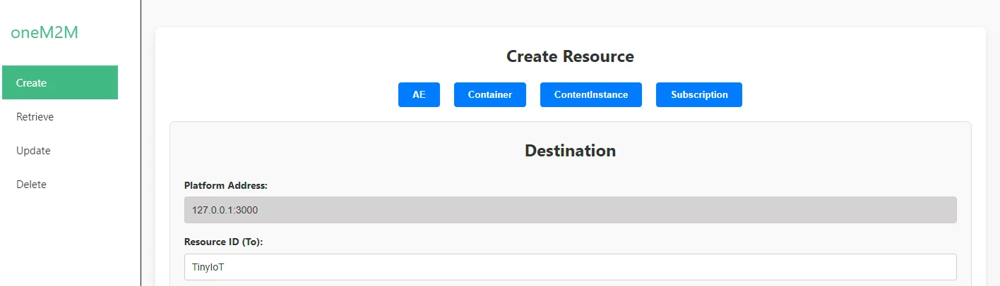
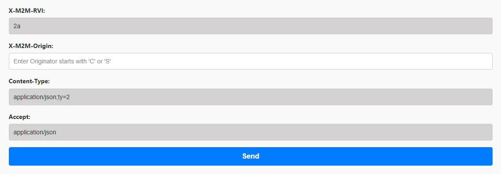

# oneM2M Vue Application - Guide

## Installation

1. Requirements before installation
    1. Download or Clone Code from Github
    2. Install nvm
    3. Install node.js v22.12.0 (If it’s not installed)
        
        ```powershell
        # Install node.js
        $ nvm install v22.12.0
        # To check the version of node.js
        $ node.js -v
        ```
        
2. Run codes in console opened in ‘**vue-project’** directory
    
    ```powershell
    $ npm install
    $ npm run serve # or npm run dev
    ```
    

## Features

1. Create Request
    1. Click Create Button
    2. Fill editable attributes
        
        
        |  | AE | Container | ContentInstance | Subscription |
        | --- | --- | --- | --- | --- |
        | rn(Resource Name) | O (Mandatory) | O (Mandatory) | O | O (Mandatory) |
        | lbl(Label) | O | O | O | X |
        | mni | X | O | X | X |
        | mbs | X | O | X | X |
        | con | X | X | O(Mandatory) | X |
        | nu | X | X | X | O (Mandatory) |
        | nct | X | X | X | O |
        | net | X | X | X | O (Mandatory) |
        | X-M2M-RI | O (Mandatory) | O (Mandatory) | O (Mandatory) | O (Mandatory) |
        | X-M2M-Origin | O (Mandatory) | O (Mandatory) | O (Mandatory) | O (Mandatory) |
    3. Click Send Button
    4. If it’s successfully retrieved the resource, response body will appear message from server. 
    5. If not, response body will appear nothing or error code.
        
        
        
        
        
2. Retrieve Request
    1. Click Retrieve Button
    2. Fill editable attributes
        
        
        |  | AE | Container | ContentInstance | Subscription |
        | --- | --- | --- | --- | --- |
        | rn(Resource Name) | O (Mandatory) | O (Mandatory) | O (Mandatory) | O (Mandatory) |
        | Resource Destination(Resource ID(To)) | O (Mandatory) | O (Mandatory) | O (Mandatory) | O (Mandatory) |
        | X-M2M-RI | O (Mandatory) | O (Mandatory) | O (Mandatory) | O (Mandatory) |
    3. Click Retrieve Button
    4. If it’s successfully retrieved the resource, response body will appear with data from server. 
    5. If not, response body will appear nothing or error code.
        
        
        
        
        
3. Update Request
    1. Click Update Button
    2. Fill editable attributes
        
        
        |  | AE | Container | Subscription |
        | --- | --- | --- | --- |
        | lbl(Label) | O | O | X |
        | nu | X | X | O (Mandatory) |
        | X-M2M-RI | O (Mandatory) | O (Mandatory) | O (Mandatory) |
    3. Click Update Button
    4. If it’s successfully retrieved the resource, response body will appear message from server. 
    5. If not, response body will appear nothing or error code.
        
        
        
        
        
4. Delete Request
    1. Click Delete Button
    2. Fill editable attributes
        
        
        | Resource Destination(Resource ID(To)) | O (Mandatory) |
        | --- | --- |
        | X-M2M-RI | O (Mandatory) |
    3. Click Delete Button
    4. If it’s successfully retrieved the resource, response body will appear message from server. 
    5. If not, response body will appear nothing or error code.
        
        