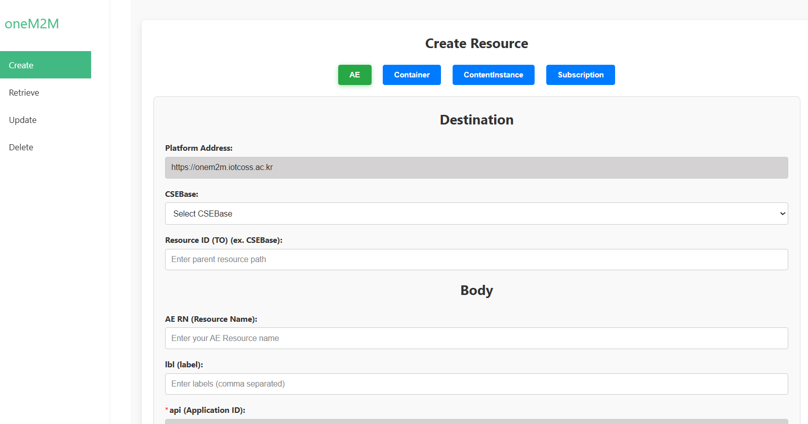
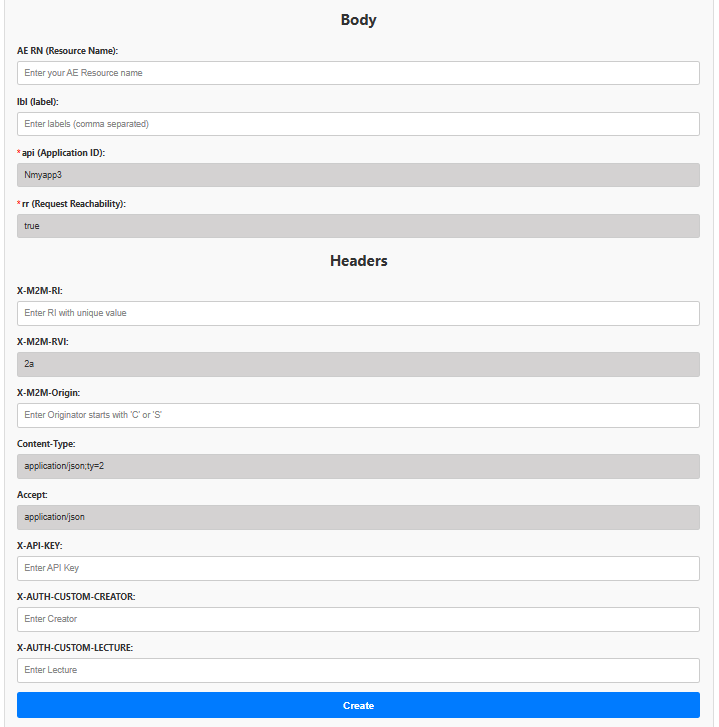
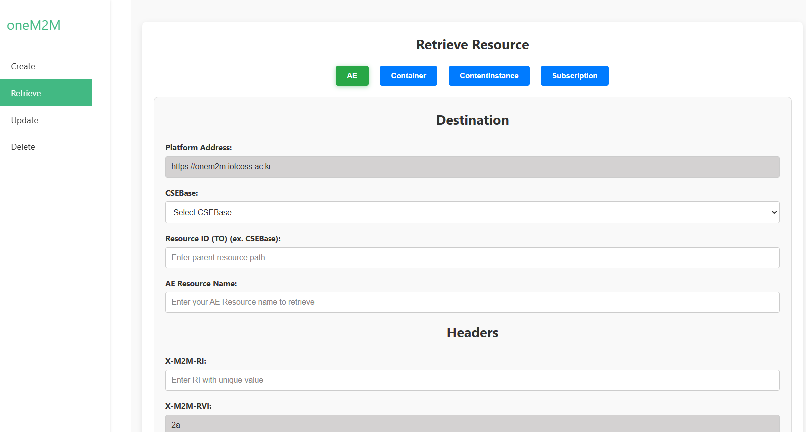
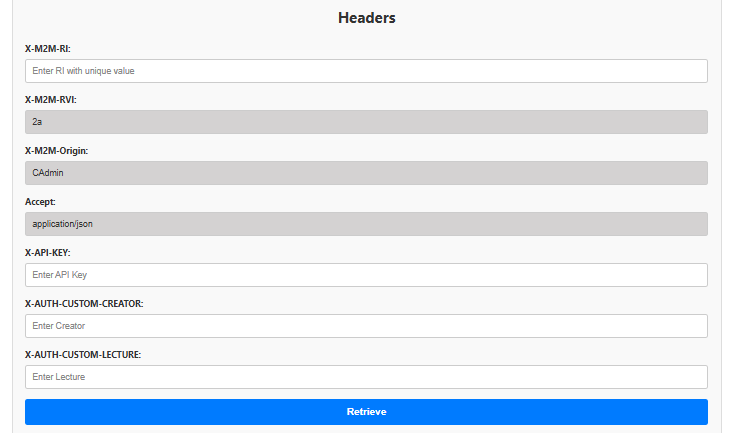
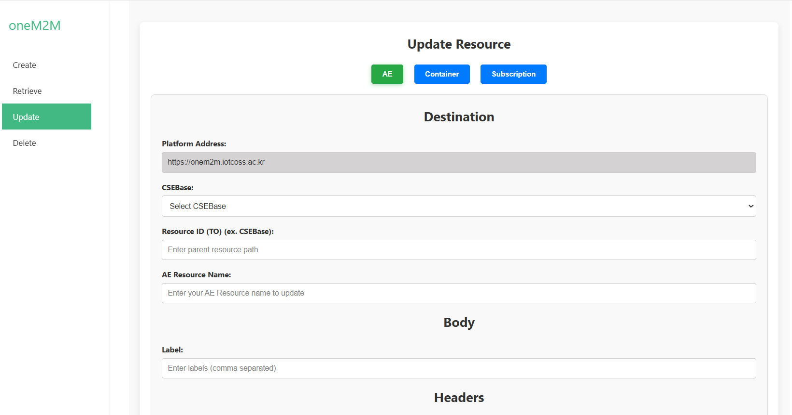
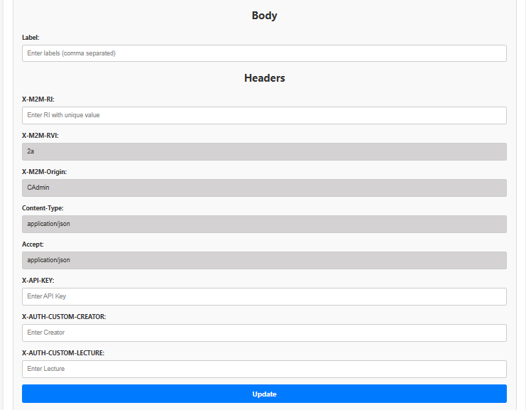
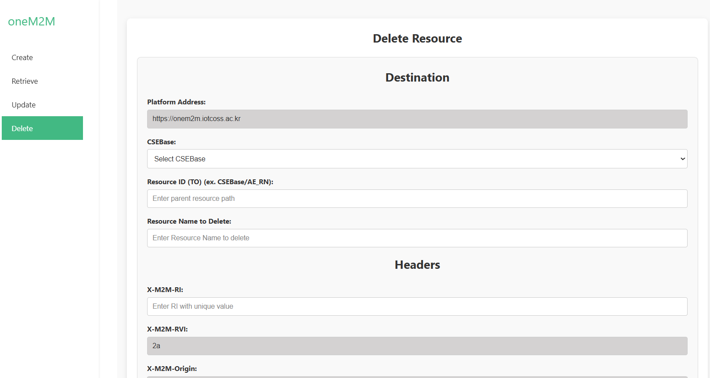
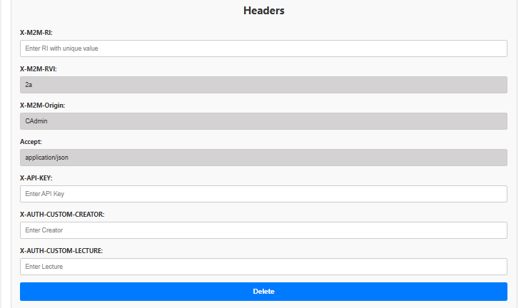

# oneM2M Vue Application - Guide

## 설치

1. app 설치 전 필수 요소들 설치 
    
    1. Github 에서 코드 다운로드 또는 클론
    2. nvm 설치
    3. node.js v22.12.0 설치 (설치되지 않은 경우)
        
    ```powershell
    # node.js 설치
    $ nvm install v22.12.0
    # node.js의 버전 확인
    $ node.js -v
    ```
        
2. ‘**vue-project’** 디렉토리로 이동하여 코드를 실행 
    
    ```powershell
    $ npm install
    $ npm run dev # or npm run serve 
    ```
    

## 지원 기능

1. Create Request
    1. 좌측 메뉴에서 create 선택 
    2. CSEBase 선택 
    3. 생성하고자 하는 리소스 선택 후, 필요 입력 요소들 입력 
    4. Create  버튼 클릭 
    5. 성공적으로 생성되었다면 토스트 알림과 함께 하단부에 request, response의 body 부분이 나타남  
    6. 그렇지 않다면 하단부가 비어 있거나 에러 코드가 나타남 
        
        
        
        
        
2. Retrieve Request
    1. 좌측 메뉴에서 retrieve 선택 
    2. CSEBase 선택 
    3. 조회하고자 하는 리소스 선택 후, 필요 입력 요소들 입력 
    4. Retrieve 버튼 클릭 
    5. 성공적으로 조회되었다면 토스트 알림과 함께 하단부에 request의 header와 response의 body 부분이 나타남
    6. 그렇지 않다면 하단부가 비어 있거나 에러 코드가 나타남
        
        
        
        
        
3. Update Request
    1. 좌측 메뉴에서 Update 선택 
    2. CSEBase 선택 
    3. 변경하고자 하는 리소스 선택 후, 필요 입력 요소들 입력
    4. Update 버튼 클릭 
    5. 성공적으로 변경되었다면 토스트 알림과 함께 하단부에 request, response의 body 부분이 나타남
    6. 그렇지 않다면 하단부가 비어 있거나 에러 코드가 나타남
        
        
        
        
        
4. Delete Request
    1. 좌측 메뉴에서 Delete 선택
    2. CSEBase 선택 
    3. 삭제하고자 하는 리소스 요소들 입력 
    4. Delete 버튼 클릭 
    5. 성공적으로 삭제되었다면 토스트 알림과 함께 하단부에 request의 헤더와 삭제 메시지가 나타남 
    6. 그렇지 않다면 하단부가 비어 있거나 에러 코드가 나타남
        
        
        
        
